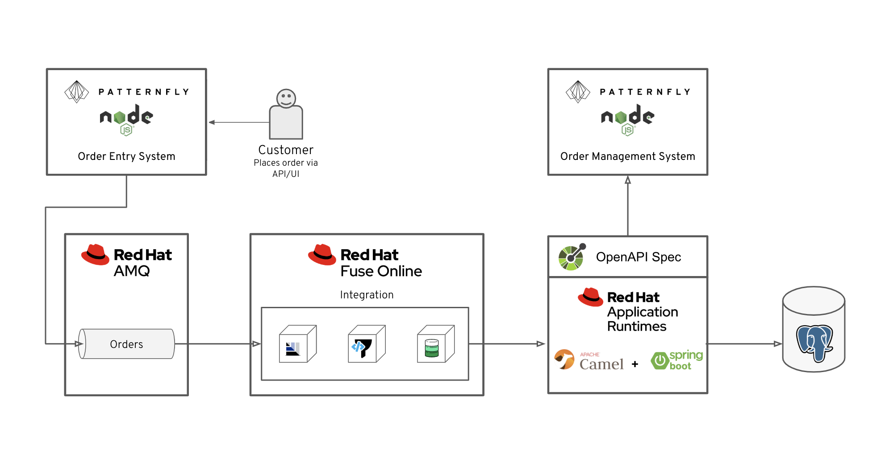

// update the component versions for each release
:fuse-version: 7.4
:amq-version: 7.4

// URLs
:openshift-console-url: {openshift-host}/console
:fuse-documentation-url: https://access.redhat.com/documentation/en-us/red_hat_fuse/{fuse-version}/
:amq-documentation-url: https://access.redhat.com/documentation/en-us/red_hat_amq/{amq-version}/

//attributes
:title: Connecting applications using asynchronous messaging
:tasksdir: ../_tasks/
:create-messages-app: Order Entry System
:retrieve-messages-app: Order Management System
:standard-fail-text: Verify that you followed all the steps. If you continue to have issues, contact your administrator.

//id syntax is used here for the custom IDs because that is how the Solution Explorer sorts these within groups
[id='1-connecting-apps-asynchronous-messaging']
= {title}

// word count that fits best is 15-22, with 20 really being the sweet spot. Character count for that space would be 100-125
Learn how to create a simple integration with built-in monitoring, so you can enable fault tolerant communication between applications.

*Welcome to Cruddy’s Car Parts*

In this Solution Pattern, you will be using two applications from a fictitious company called Cruddy’s Car Parts. Both applications are built with PatternFly, an open source design system, and Node.js.

* {create-messages-app} - Provides a RESTful API and a user interface to create order messages for customers.
* {retrieve-messages-app} - Uses a RESTful API that is built with Red Hat Fuse for querying and creating orders in an underlying PostgreSQL database.

[type=walkthroughResource,serviceName=openshift]
.Red Hat OpenShift
****
* link:{openshift-console-url}[Console, window="_blank"]
* link:https://help.openshift.com/[OpenShift Online Help Center, window="_blank"]
* link:https://blog.openshift.com/[OpenShift Blog, window="_blank"]
****

[type=walkthroughResource,serviceName=fuse]
.Red Hat Fuse Online
****
* link:{fuse-url}[Console, window="_blank", id="resources-fuse-url"]
* link:{fuse-documentation-url}[Fuse Documentation, window="_blank"]
****

[type=walkthroughResource,serviceName=amq-online-standard]
.Red Hat AMQ Online
****
* link:{enmasse-url}[Console, window="_blank", , id="resources-enmasse-url"]
* link:{amq-documentation-url}[AMQ Documentation, window="_blank"]
****

:sectnums:

//Task 1
include::{tasksdir}creating-an-address.adoc[]

//Task 2
include::{tasksdir}creating-a-table.adoc[]

//Task 3
include::{tasksdir}creating-connections.adoc[]

//Task 4
include::{tasksdir}creating-an-integration.adoc[]

//Task 5
include::{tasksdir}using-the-integration.adoc[]
