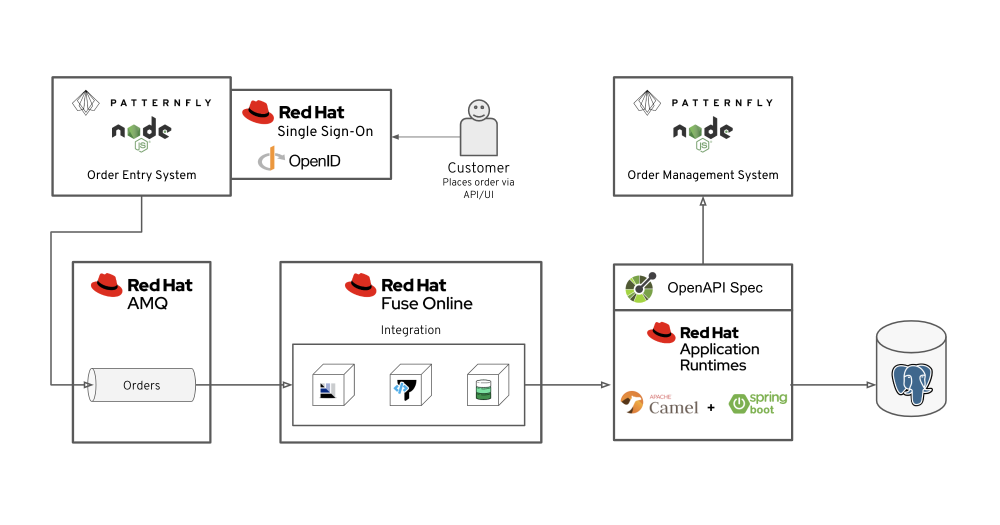

// update the component versions for each release
:sso-version: 7.3

// URLs
:openshift-console-url: {openshift-host}
:sso-realm-url: {user-sso-url}/auth/admin/{user-username}/console/index.html
:sso-adapter-docs-url: https://access.redhat.com/documentation/en-us/red_hat_single_sign-on/{sso-version}/html/securing_applications_and_services_guide/index
:sso-realm-url: {user-sso-url}/auth/admin/solution-patterns/console/index.html

//attributes
:title: 2 - Protecting applications using single sign-on
:sp1-title: Connecting applications using asynchronous messaging
:create-messages-app: Order Entry System
:retrieve-messages-app: Order Management System
:rhmi-sso-name: Managed Integration SSO instance
:customer-sso-name: Customer Application SSO
:client-name: {user-username}-order-entry-system
:realm-name: solution-patterns
:realm-display-name: Solution Patterns Realm
:shared-realm-username: developer
:standard-fail-text: Verify that you followed all the steps. If you continue to have issues, contact your administrator.

//id syntax is used here for the custom IDs because that is how the Solution Explorer sorts these within groups
[id='2-protecting-apps-sso']
= {title}

// word count that fits best is 15-22, with 20 really being the sweet spot. Character count for that space would be 100-125
Learn how to setup {customer-sso-name} to protect end-user applications by using standards such as OpenID Connect, OAuth 2.0, and SAML 2.0.

NOTE: You must complete the _{sp1-title}_ Solution Pattern before starting this one.

//If I make this a title, it breaks the layout.
*Welcome back to Cruddy’s Car Parts*

In this Solution Pattern, you will continue to use the {create-messages-app} and the {retrieve-messages-app} applications from the _{sp1-title}_ Solution Pattern. Now, you will protect them from unauthorised access by creating and enabling a single sign-on service.

[type=walkthroughResource,serviceName=openshift]
.Red Hat OpenShift
****
* link:{openshift-console-url}[Console, window="_blank"]
* link:https://help.openshift.com/[OpenShift Online Help Center, window="_blank"]
* link:https://blog.openshift.com/[OpenShift Blog, window="_blank"]
****

[type=walkthroughResource,serviceName=3scale]
.{customer-sso-name}
****
* link:{sso-realm-url}[Shared SSO Realm, window="_blank"]
* link:https://access.redhat.com/products/red-hat-single-sign-on/[Red Hat Single Sign-On Overview, window="_blank"]
****

:sectnums:

[time=7]
== Creating a client

To secure your application with single sign-on, you must create a client in a realm.

The client represents the application being secured. It contains important details regarding the type of security applied to the application.

The realm is a  what users belong to so they can log in.
Realms are isolated from one another and can only manage and authenticate the users that belong to them.
You can use the Customer Application SSO to log in to a realm and manage your *Clients*, *Roles*, *Users* and *Groups*.

*What is Customer Application SSO?*
****
Customer Application SSO, included with Red Hat Managed Integration, enables you to define the identities of your end users.
Red Hat manages this instance, however there are some additional users with admin level privileges who can configure this instance.
****

NOTE: The realm used in this Solution Pattern is shared with *all* users on the cluster. *Do not use this realm for production applications*.

. Go to the link:{sso-realm-url}[{realm-display-name}, window="_blank"].
. If prompted, enter the username `{shared-realm-username}` and password `password`. You will see the *Realm Settings* screen for the *{realm-name}* realm if the login is successful.
. Select *Clients* from the vertical navigation menu on the left side of the screen.
. Click the *Create* button on the top right of the Clients screen.
. On the *Add Client* screen:
.. In the *Client ID* field, enter `{client-name}`.
.. Verify the *Client Protocol* is set to *openid-connect*.
.. In the *Root URL* field, paste the URL of the *{create-messages-app} UI* from the *{sp1-title}* Solution Pattern. This should look similar to `https://order-entry-ui-{user-username}-<NAMESPACE>.{openshift-app-host}`
.. Click *Save*.
. The *Settings* screen for the {client-name} client should be displayed.
. Verify that the *Access Type* field is set to *public*. This means the client is a frontend application that needs to log in using a web browser.

[type=verification]
Select *Clients* from the vertical navigation menu on the left side of the screen.
Is the `{client-name}` client listed and is the *Enabled* field set to *True*?

[type=verificationFail]
In the *Settings* tab on the *Client* page, make sure that the *Enabled* toggle is set to *ON*. {standard-fail-text}

[time=7]
== Creating a user

Red Hat Single Sign-On provides identity brokering functionality, which facilitates login using a shared identity. For example, it is possible
to create an *Identity Provider* in a *Realm* in SSO to enable login
using social identities such as Google, Twitter, or GitHub. When the user
chooses to login using an *Identity Provider* a *User* is automatically created
in the SSO *Realm* with the details from their chosen
*Identity Provider*.

In this Solution Pattern a *User* will be created manually to keep things
simple.

. Navigate to the link:{sso-realm-url}[SSO Realm, window="_blank"].
. Enter the username `{shared-realm-username}` and password `password` if prompted.
. Select the *Users* entry in the side menu.
. Click *Add user*.
.. Enter the username `customer`.
.. Leave other fields with their default values and click *Save*.
. The `customer` user details should now be displayed with tabs along the top of the UI.
. Select the *Credentials* tab.
.. Enter the password `customer-password` in the *New Password* field.
.. Enter the same password in the *Password Confirmation* field.
.. Set the *Temporary* toggle to the *OFF* position.
+
NOTE: If we left *Temporary* in the *ON* position the user would be forced to create a new password when they perform a login.
.. Click the *Reset Password* button.
.. When prompted click the *Change password* button in the modal.

[type=verification]
Select the *Users* item in the side menu. Click the *View all users* button. Is the `customer` user listed?

[type=verificationFail]
{standard-fail-text}

[time=15]
== Enabling SSO in the {create-messages-app}

=== Obtaining the SSO configuration

To secure an application with SSO a *Client Adapter* is required.
Various platforms are supported with *Client Adapters*:

* Spring Boot
* Node.js
* JBoss EAP
* Fuse
* JavaScript (client-side)
* Servlet Filter

{blank}

The *{create-messages-app}* is run from a Node.js server, so the Node.js
`keycloak-connect` adapter is included in the code. The following steps will
demonstrate how to include a configuration and enable the adapter.

. Navigate to the link:{sso-realm-url}[SSO Realm, window="_blank"].
. Enter the username `{shared-realm-username}` and password `password` if prompted.
. Select *Clients* from the side menu.
. Click the `{client-name}` client that was created earlier.
. Choose the *Installation* tab.
. Select *Keycloak OIDC JSON* for *Format Option*.
. Click the *Download* button to download this as a _keycloak.json_ file.

=== Creating a SSO Config Map Entry

. Login to the link:{openshift-console-url}[OpenShift Console, window="_blank"].
. Select the project that contains *walkthroughs-1A-integrate-event-and-api-driven-apps* in the name.
. Select *Resources > Config Maps*.
. Click the *Create Config Map*  button.
.. Enter `order-entry-keycloak-config` in the *Name* field.
.. Enter `KEYCLOAK_CONFIG` in the *Key* field.
.. Click the *Browse* button and select the _keycloak.json_ file that was downloaded in the previous section.
. Click the *Create* button.

=== Applying the SSO Config Map

. Log in to the link:{openshift-console-url}[OpenShift Console, window="_blank"].
. Navigate to the *walkthroughs-1A-integrate-event-and-api-driven-apps* project.
. Select *Applications > Deployments*.
. Select the *rhmi-lab-nodejs-order-frontend* item from the *Deployments* list.
. Select the *Environment* tab.
.. Click *Add Value from Config Map or Secret*
.. Enter `KEYCLOAK_CONFIG` in the *Name* column.
.. Choose `order-entry-keycloak-config` from the *Select a resource* dropdown.
.. Choose *KEYCLOAK_CONFIG* from the *Select key* menu.
. Scroll down and click *Save*.
. Select *Overview* on the left and find the *rhmi-lab-nodejs-order-frontend* in the list.
. If a deployment is still in progress, wait for it to finish.
. Open the URL listed beside the *rhmi-lab-nodejs-order-frontend* in either a private browser session, or a different browser to view the *{create-messages-app}* UI.
+
NOTE: Use a private session or different browser to avoid conflict with your old sessions.

. A login screen with the title *walkthroughs Realm* is displayed.
. Enter `customer` in the *Username or email*.
. Enter `customer-password` in the *Password* field.
. Click the *Log In* button.

[type=verification]
The login should be successful. Is the *{create-messages-app}* web application displayed?

[type=verificationFail]
If a login page is not presented try opening the *{create-messages-app}* in a private browsing session or different browser. {standard-fail-text}

[type=taskResource]
.Task Resources
****
* link:{sso-adapter-docs-url}[Securing Applications and Services with SSO, window="_blank"]
****
